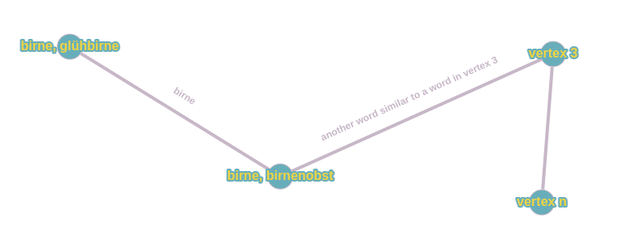

# German_language_synonym_patterns

Context:

Language sometimes offers different words for the same meaning. This is widely known as synonyms. Furthermore, there 
are words, which can be used for different meanings depending on the context the speaker uses them. This Python codes 
builds a graph with synonym sets as vertices and connects vertices including one or more same words with edges. 
A shortest path algorithm (dijekstra implemented) can be used to find the shortest path from one word to another 
with the help of their individual synonyms. A small picture shall help to understand the idea.

The german language is used with a synonym dataset from https://www.openthesaurus.de/

Usage:

The main function includes examples with different pairs of words, which can be changed by the user. Call the 
Script main.py and see the output in the console. The example below shows the console output for the pair (Fessel, Zettel)

Example:

Basic Information  
start word is found in 6 different word-patterns  
end word is found in 3 different word-patterns  
Starting Node:  
unsicherheit  
Task:  
Finde den kürzesten Weg zum Wort: gewissheit  
Das Wort unsicherheit im Kontext von ['standardmessunsicherheit', 'standardunsicherheit', 'unsicherheit', 'messunsicherheit'] wird auch als ['unsicherheit'] Im Kontext von ['bedrohung', 'gefahr', 'stolperfalle', 'fährnis', 'wagnis', 'unsicherheit', 'fährde', 'pulverfass', 'risiko', 'drohendesunheil', 'potentielleschadeinwirkung', 'gefährdung'] verwendet   
Das Wort wagnis ist ein Synonym des Wortes {'unsicherheit'} in diesem neuen Kontext    
Das Wort wagnis im Kontext von ['bedrohung', 'gefahr', 'stolperfalle', 'fährnis', 'wagnis', 'unsicherheit', 'fährde', 'pulverfass', 'risiko', 'drohendesunheil', 'potentielleschadeinwirkung', 'gefährdung'] wird auch als ['wagnis'] Im Kontext von ['erlebnis', 'wagnis', 'abenteuer', 'aventüre'] verwendet  
Das Wort erlebnis ist ein Synonym des Wortes {'wagnis'} in diesem neuen Kontext    
Das Wort erlebnis im Kontext von ['erlebnis', 'wagnis', 'abenteuer', 'aventüre'] wird auch als ['erlebnis'] Im Kontext von ['erlebnis', 'erfahrung', 'erleben'] verwendet  
Das Wort erfahrung ist ein Synonym des Wortes {'erlebnis'} in diesem neuen Kontext    
Das Wort erfahrung im Kontext von ['erlebnis', 'erfahrung', 'erleben'] wird auch als ['erfahrung'] Im Kontext von ['kenntnisse', 'geübtheit', 'wissen', 'routine', 'sicherheit', 'kenntnis', 'übung', 'erfahrung', 'praxis', 'know-how', 'erfahrungen'] verwendet  
Das Wort sicherheit ist ein Synonym des Wortes {'erfahrung'} in diesem neuen Kontext    
Das Wort sicherheit im Kontext von ['kenntnisse', 'geübtheit', 'wissen', 'routine', 'sicherheit', 'kenntnis', 'übung', 'erfahrung', 'praxis', 'know-how', 'erfahrungen'] wird auch als ['sicherheit'] Im Kontext von ['zuverlässigkeit', 'gewissheit', 'sicherheit', 'unzweifelhaftigkeit', 'klarheit'] verwendet
{'sicherheit'} ist ein Synonym von gewissheit im neu gewählten Kontext  
Endknoten gefunden (gewissheit)

